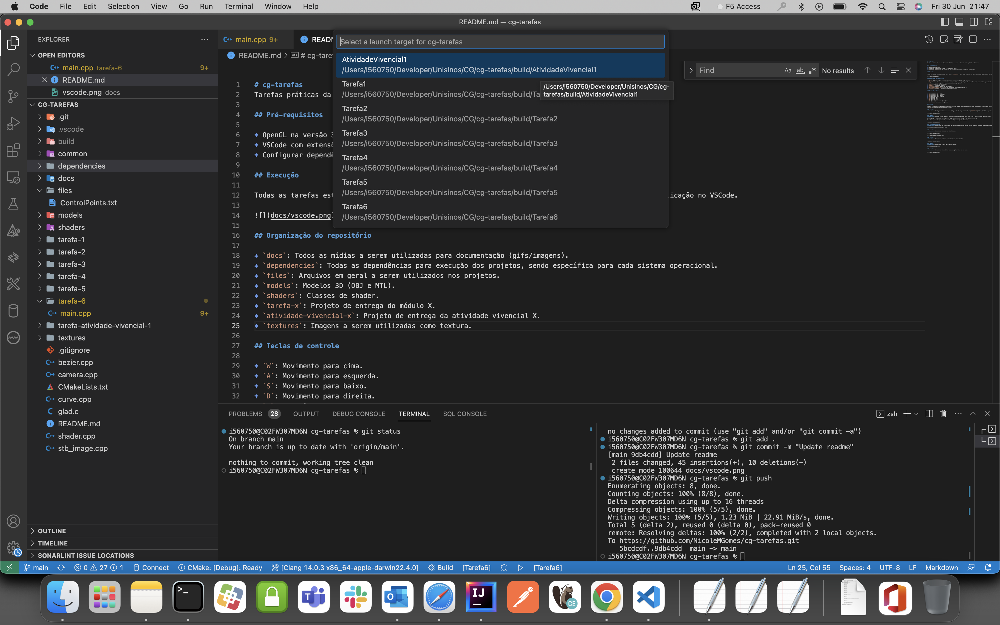
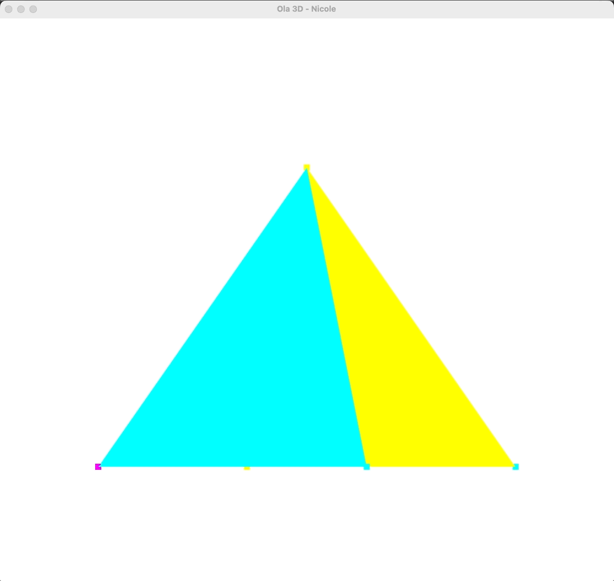
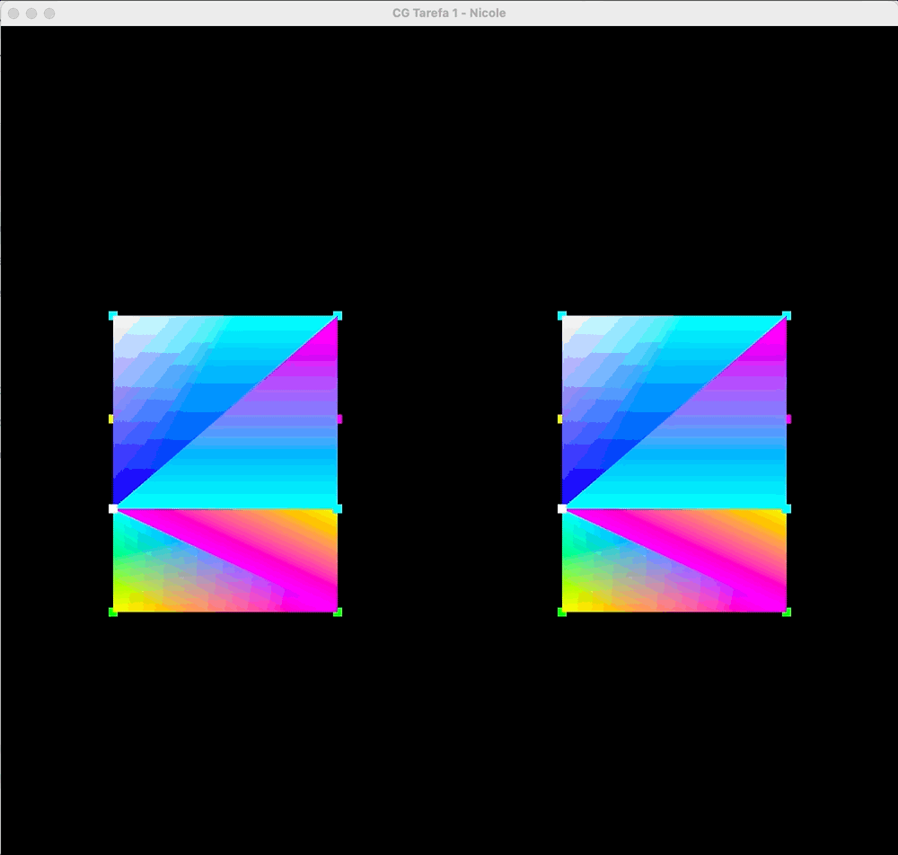
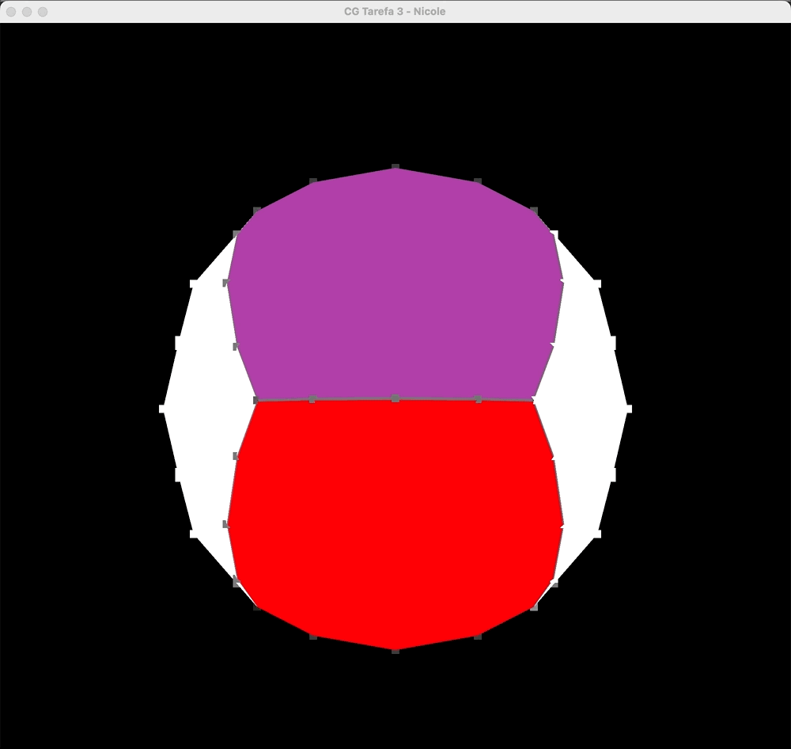
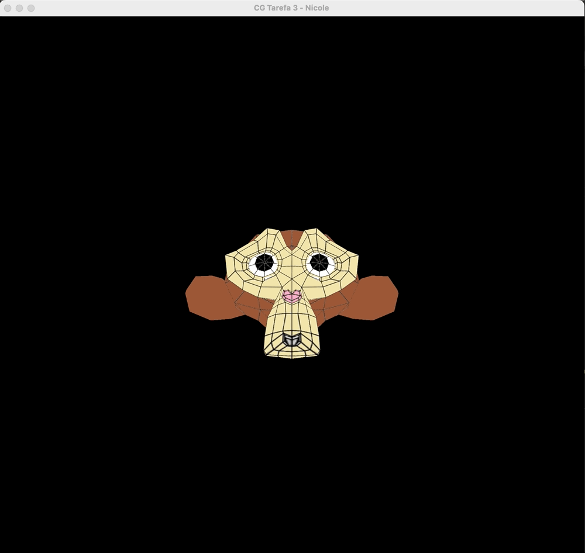

# cg-tarefas
Tarefas práticas da cadeira Computação Gráfica do curso de Ciência da Computação da Unisinos.

## Pré-requisitos

* OpenGL na versão 3.3.
* VSCode com extensões de CMake, C/C++ e CMake Tools.
* Configurar dependências de acordo com seu sistema operacional (macOS já disponível).

## Execução

Todas as tarefas estão descritas no arquivo `CMakeLists`. Para rodar a aplicação basta selecionar a aplicação no VSCode.

## Organização do repositório

* `docs`: Todos as mídias a serem utilizadas para documentação (gifs/imagens).
* `dependencies`: Todas as dependências para execução dos projetos, sendo específica para cada sistema operacional.
* `files`: Arquivos em geral a serem utilizados nos projetos.
* `models`: Modelos 3D (OBJ e MTL).
* `shaders`: Classes de shader.
* `tarefa-x`: Projeto de entrega do módulo X.
* `atividade-vivencial-x`: Projeto de entrega da atividade vivencial X.
* `textures`: Imagens a serem utilizadas como textura.

## Teclas de controle

* `W`: Movimento para cima.
* `A`: Movimento para esquerda.
* `S`: Movimento para baixo.
* `D`: Movimento para direita.
* `X`: Rotação em X.
* `Y`: Rotação em Y.
* `Z`: Rotação em Z.
* `I`: Translação no eixo Z positiva.
* `J`: Translação no eixo Z negativa.

## Tarefas

Durante o semestre foram desenvolvidas sete tarefas, que de maneira sequencial foram evoluindo o visualizador utilizando como base o repositório [CGCCHibrido](https://github.com/fellowsheep/CGCCHibrido).

### Tarefa 1
**Objetivo**: Configurar ambiente e rodar código Hello 3D disponibilizado em [CGCCHibrido](https://github.com/fellowsheep/CGCCHibrido). 

### Tarefa 2
**Objetivo**: Adaptar código de Hello 3D transformando pirâmide em dois cubos, com a possibilidade de translatar e controlar a escala. 

A translação é controlada pelas teclas: WASD (translação em X e Z) e IJ (translação em Y).
O controle de escala é realizado pelas teclas E (aumentar) e Q (diminuir).

### Atividade Vivencial 1
**Objetivo**: Acrescentar ao visualizador um leitor de arquivos de malhas 3D (no momento, buscando somente a informação de geometria).

### Tarefa 3
**Objetivo**: Acrescentar texturas ao visualizador. 

### Tarefa 4
**Objetivo**: Acrescentar material e iluminação ao visualizador. 

### Tarefa 5
**Objetivo**: Acrescentar câmera em primeira pessoa. 

### Tarefa 6
**Objetivo**: Acrescentar trajetórias para os objetos lidos em sua cena.

