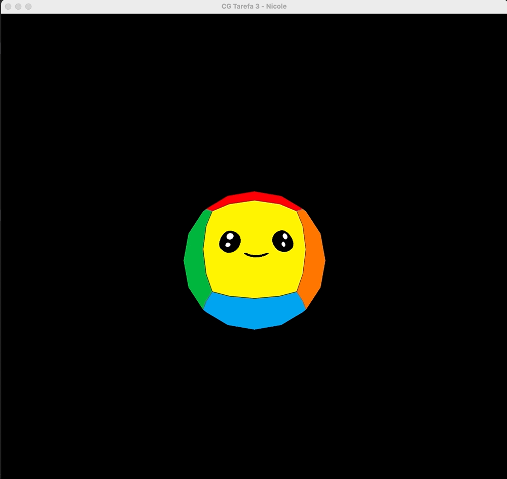

# cg-tarefas
Tarefas da cadeira Computação Gráfica do curso de Ciência da Computação da Unisinos.

## Configuração

Alterar `CMakeLists` com tarefa que será executada.

## Tarefa 1
**Objetivo**: Configurar ambiente e rodar código Hello 3D disponibilizado em [CGCCHibrido](https://github.com/fellowsheep/CGCCHibrido). 

## Tarefa 2
**Objetivo**: Adaptar código de Hello 3D transformando pirâmide em dois cubos, com a possibilidade de translatar e controlar a escala. 

A translação é controlada pelas teclas: WASD (translação em X e Z) e IJ (translação em Y).
O controle de escala é realizado pelas teclas E (aumentar) e Q (diminuir).

## Atividade Vivencial 1
**Objetivo**: Acrescentar ao visualizador um leitor de arquivos de malhas 3D (no momento, buscando somente a informação de geometria).

## Tarefa 3
**Objetivo**: Acrescentar texturas ao visualizador. 

